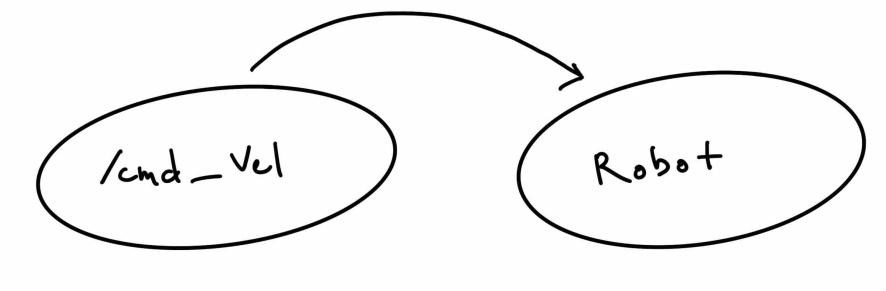
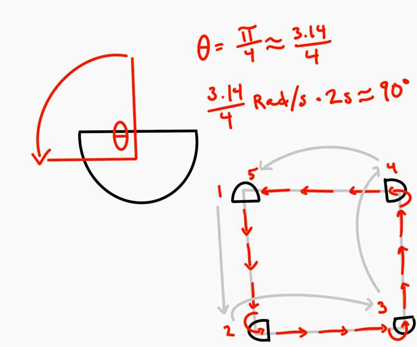
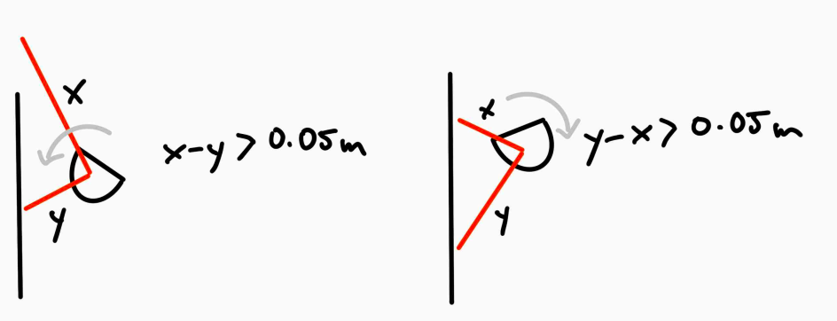
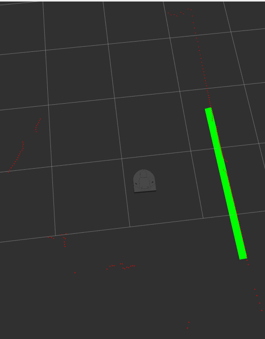
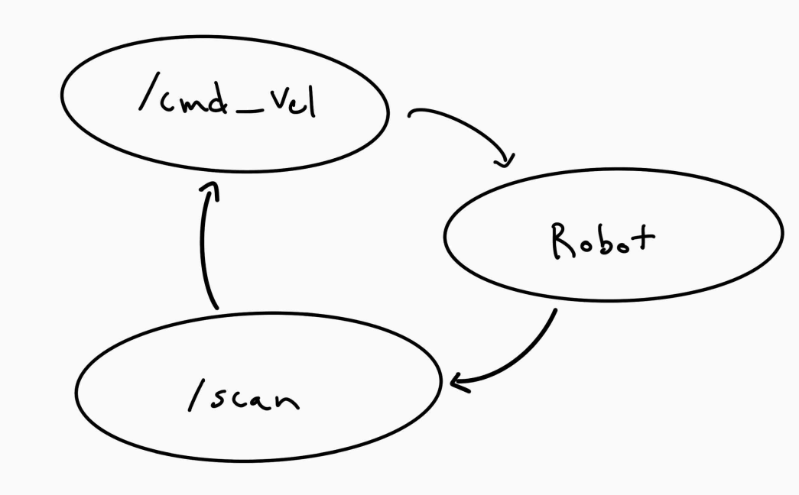
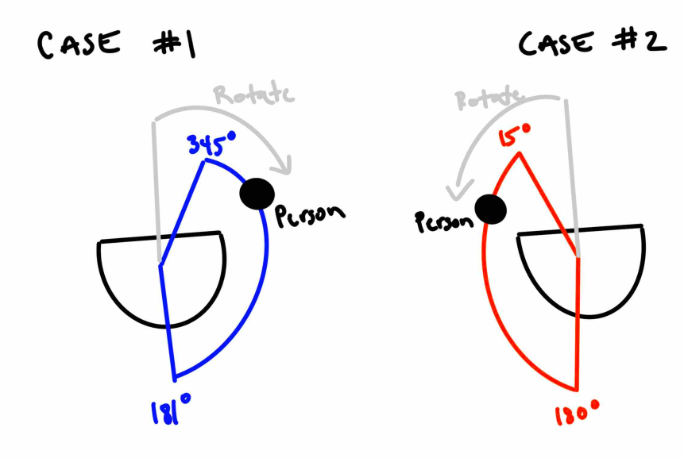

# Warmup Project
### By Satchel and Raiyan

##  Teleop

For teleop we were given the task to create a robot controller using keyboard input. To solve this problem we broke down the robot movement into 5 different states: forward, backward, rotate right, rotate left and stop. By publishing to the `cmd_vel` topic, we can have the robot move in all 5 states, which is where we get the `forward`, `backward`, `right`, `left` and `stop` function. To connect these functions to the keyboard we use a while loop in the main function that waits for `w` to move forward, `s` to move backwards, `d` to move right,`s` to move left and `f` to stop. 

### Control

The only communication between the script and the Neato is through the `cmd_vel` topic to the Neato, as shown below. The keyboard input determines what is published to the `cmd_vel` topic. 

### Future Improvements

Given more time, this task could be improved with a more robust controller that allows more ranges of movement. The default teleop package has a lot more controls and given more time we could implement them into code. 

The code could also be structured differently. Specifically, we could move the control loop into the node class. 

## Drive Square

For the drive square task, we are supposed to make the Neato drive in a square. To solve this task, we broke the square movement down into two main components rotating left 90 degrees and moving forward 1 meter. Using the `cmd_vel` topic, we first have the robot move forward 1 meter, then rotate 90 degrees and repeat this process until a square is created. The only issue we encountered is that the angular velocity is not one to one. We set the angular velocity to pi/4 radians per second, but had to use a scaling factor to get the rotation closer to 90 degrees. 

### Control

Just like the teleop controller, the only communication between the script and the Neato is through the `cmd_vel` topic to the Neato, as shown below.

### Future Improvements

Given more time, we could use the odometry of the robot to create a more accurate square drawing. The angular and forward velocity is not as accurate in real life, meaning the square was always skewed. However, these innaccuracies could be minimized by using the odometry from the robot instead of just relying on velocity calculations. 

## Wall Following

For the wall following task, we are supposed to have NEATOs movement be parallel to a wall. To keep the task simpler, we have it follow a wall to the left of the robot. We subscribe to the scan topic to get the lidar scan data from the neato. Then we take the measurement at 90 degrees to see the distance the neato is from the wall. If it is farther than 0.3 away from the wall then it uses the 45 degree and 135 degree measurement to follow the wall. If it is not within that range then the robot tries to get back into the range of that wall by rotating the direction it needs to while moving forward at the same time. 

The wall following logic is fairly simple. If both the 45 and 135 degree measurements are non zero, we subtract them. If the difference is less than 0.05 meters we know that the front of the neato is closer to the wall the back, so the robot needs to rotate right and move forward. If the opposite is true then the robot needs to rotate left and forward. 

The result of this type of wall detection is shown below in Rviz.

### Control

This control loop for this task also uses the output of the lidar scan to control the Neato. The Neato communicates the lidar scan through the `scan` topic, which then changes the direction the robot has to move. This changes what velocity commands are sent through the `cmd_vel` topic to the robot. This cycle maintains the wall following logic explained above.

### Future Improvements

Given more time, we could create a more robust and accurate wall detection algorithm, such as using RANSAC. This would create a better and more consistent wall follower, rather than one that relies on very specific angle measurements. 

## Person Follower 

For the person follower problem, we are tasked with having the Neato follow a person. Our approach is fairly simple, we have the Neato follow the closest object that is not 0.5 meters away. If the nearest object is 0.5 meters or closer, then the Neato will stop. If the person is not directly in front of the neato the neato will try to rotate towards the person. 

### Control

The topic communication is the same as the wall following task. The Neato communicates the lidar scan through `scan`, which effects what is sent through the `cmd_vel` topic which changes where the Neato is. 

### Future Improvements

Given more time, we could create a more robust and reactive person follower that could match the speed of the person. Because our Neato is slow to allow for it to accurately find a person, the effectiveness of it as a person follower is minimzed. However, if it can also match the velocity of the person, it would overcome some of those hurdles. 

## Obstacle Avoidance

For the obstacle avoidance problem, we are tasked with having the Neato avoid obstacles, while moving forward. To tackle this task, we broke it up into two tasks, mainting the forward orientation and avoiding obstacles. First, we tackled avoiding obstacles by finding the angle where the object is the closest and within 0.6 meters. If the obstacle is within 320 to 360 degrees the Neato moves right and if the obstacle is within 0 to 40 degrees then the Neato moves left. If the object is close to the neato but not in that range then the Neato moves forward. 

The tricky decisions came from maintaining the orientation. In order to maintain the forward orientation, we record the change in angle use a rotation counter, where 0 is the original forward orientation. If the neato rotates right, the rotation value is subtracted from the rotation counter, and if the neato rotates left, the rotation value is added to the rotation counter. Once the closest object is farther away than 0.6 meters, the robot rotates back to the 0 rotation and starts moving forward again.

### Control

The topic communication is the same as the wall following and person following task. The Neato communicates the lidar scan through `scan`, which effects what is sent through the `cmd_vel` topic which changes where the Neato is. 

### Future Improvements

Given more time, we could implement the forces algorithm that was shown in the assignment. This would create a better obstacle avoider that would be able to more consistently and smoothly avoid obstacles, while moving in one direction. 

## Finite State Machine

For the finite state machine, we integrated the logics of obstacle avoidance and person-following. In our previous code, we had already utilized states to manage the robot's logic. For this challenge, we added additional states specific to each of the prior behaviors. This allowed us to maintain a similar logic but expand the number of states we employed. One of the reasons we combined these two behaviors was because their parameters complemented each other. The person-following behavior would stop within a certain distance, while the obstacle avoidance would adjust its orientation and navigate around an object once it came within a certain distance.

The resulting behavior was quite intriguing, almost giving the robot a semblance of personality. It would follow a detected person, and upon coming very close, it would turn left or right to navigate around them. Once it reached a certain distance away, the robot would then turn back and resume following the person.

### Control

The topic communication is the same as the wall following, person following and obstacle avoidance behaviors. The Neato communicates the lidar scan through `scan`, which effects what is sent through the `cmd_vel` topic which changes where the Neato is. 

### Future Improvements

For future enhancements, we could refine both the person-following and wall-following behaviors to ensure greater robustness in dynamic environments. Another area for improvement is the code structure within our finite state machine. By implementing best coding practices and optimizing parameters for each of the two distinct behaviors, we can further enhance performance. Additionally, we could delve deeper into our state structure. It would be interesting to see how much more we can streamline the code by further extracting into state logic.

## Conclusion

### Code Structure

The structure of the code is fairly consistent through each script. The node is wrapped in a class with different functions to publish and subscribe to different topics.

The only time the structure is deviated from slightly is in `teleop`. The control loop is outside of the class and in the main function, thus the node is never spun. However, for all other tasks the node is spun and the control loop logic is contained within the class using a timer. 

### Challenges

Throughout this project, the major challenges were also difficulties with getting the software to work correctly. There were a variety of issues with connecting to the Neato are getting Ros to work in general.

However, after getting through those issues, one other difficulty was conceptualizing some of our implementation, especially with obstacle avoidance and person following. However, we found that drawing out all the steps was very helpful and helped us fix logic issues in our code.

The last difficulty we had was while testing not thinking about the robot's environment in context. Specifically, we found that our code was not working because the part of the setup for the Neato was covering up the front of the Lidar sensor, which gave us unexpected behaviour.

### Takeaways

Our biggest takeaway is the importance of conceptualizing logic before implementing it in code. This allows for easier debugging and makes it easier to find logic issues. Visualizing and thinking through every step will be helpful in future assignments, as it would make it easier to understand the robot's behaviour. 

Asking help from CAs was another big takeaway. It makes it a lot easier to solve issues that we were stuck at, either issues with our computer or logic issues, by asking for help. In future assignments, we will utilize the help of the CAs to help us when we are stuck. 

